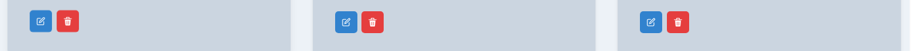

# Techifice Store

Techifice Store is an eBook store built using the MERN stack (MongoDB, Express, React, Node.js). This project demonstrates my skills in full-stack web application with a frontend built using React and Chakra UI, and a backend built using Express and MongoDB.

### Production available at [techificestore.render.com](https://techificestore.render.com)


[Watch the Video Demo Here](https://youtu.be/eDfGuFOzxwo)

## Features

- View available eBooks


- Add new eBooks


- Update existing eBooks


- Delete eBooks




- Light/Dark mode toggle


## Technologies Used

### Frontend

- React
- Chakra UI
- React Router
- Zustand (for state management)
- Vite (for development and build)

### Backend

- Node.js
- Express
- MongoDB
- Mongoose
- Dotenv (for environment variables)

## Getting Started

### Prerequisites

- Node.js
- npm or yarn
- MongoDB

### Installation

1. Clone the repository:

   ```sh
   git clone https://github.com/your-username/mern-crash-course.git
   cd mern-crash-course
   ```

2. Install dependencies for both frontend and backend:

   ```sh
   npm install
   npm install --prefix frontend
   ```

3. Create a `.env` file in the root directory and add your MongoDB URI:

   ```env
   MONGO_URI=your_mongodb_uri
   PORT=5000
   ```

### Running the Application

1. Start the backend server:

   ```sh
   npm run dev
   ```

2. Start the frontend development server:

   ```sh
   npm run dev --prefix frontend
   ```

3. Open your browser and navigate to `http://localhost:3000`.

## Project Structure

### Frontend


- `src/components`: Contains reusable React components such as `Navbar` and `ProductCard`.
- `src/pages`: Contains page components like `HomePage` and `CreatePage`.
- `src/store`: Contains Zustand store for managing product state.
- `src/App.jsx`: Main application component.
- `src/main.jsx`: Entry point for the React application.

### Backend

- `backend/controllers`: Contains controller functions for handling product-related operations.
- `backend/models`: Contains Mongoose models for MongoDB collections.
- `backend/routes`: Contains Express routes for API endpoints.
- `backend/config`: Contains database configuration.
- `backend/server.js`: Entry point for the Express server.

## Available Scripts

### Frontend

- `npm run dev --prefix frontend`: Starts the frontend development server.
- `npm run build --prefix frontend`: Builds the frontend for production.
- `npm run preview --prefix frontend`: Previews the production build.
- `npm run lint --prefix frontend`: Lints the frontend code.

### Backend

- `npm run dev`: Starts the backend development server.
- `npm run build`: Installs dependencies and builds the frontend.
- `npm start`: Starts the backend server in production mode.

## License

This project is licensed under the MIT License.

